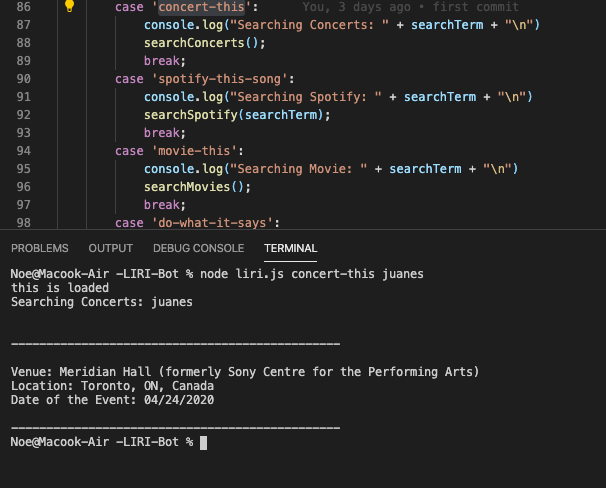
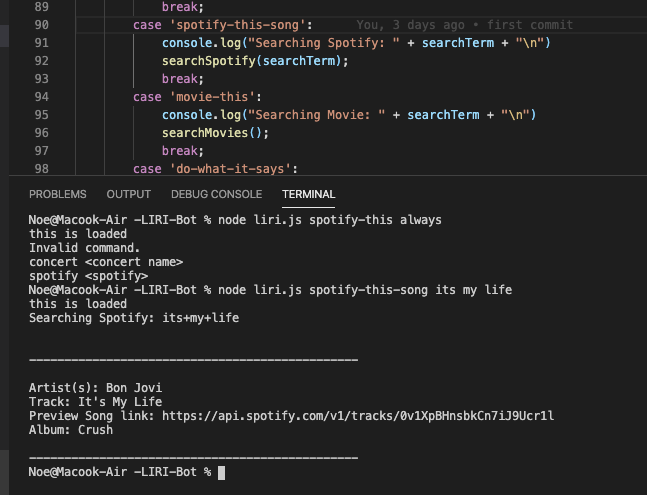
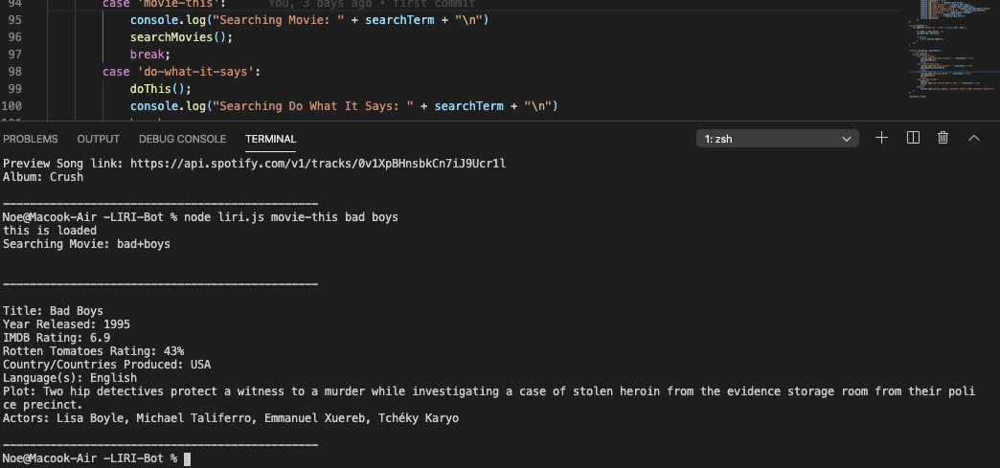
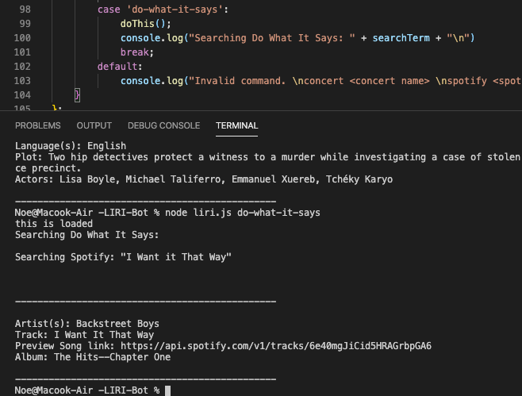

# -LIRI-Bot
In this application you can type in the terminal node liri.js concert-this (Artist)and it will populate when and where the artist is going to perfom. 

for information on a song you would simply just type in the terminal node liri.js spotify-this-song (name of song)and the song will populate with the name of the album and link to preview the song.

Also to get information about a movie you would type in the terminal node liri.js movie-this (movie name)you will then get title, year released, IMDB rating, rotten tomatos rating, country, language,plot and actors.

If you type node liri.js do-what-it-says it will list a random song that was done under the random.txt file. 

